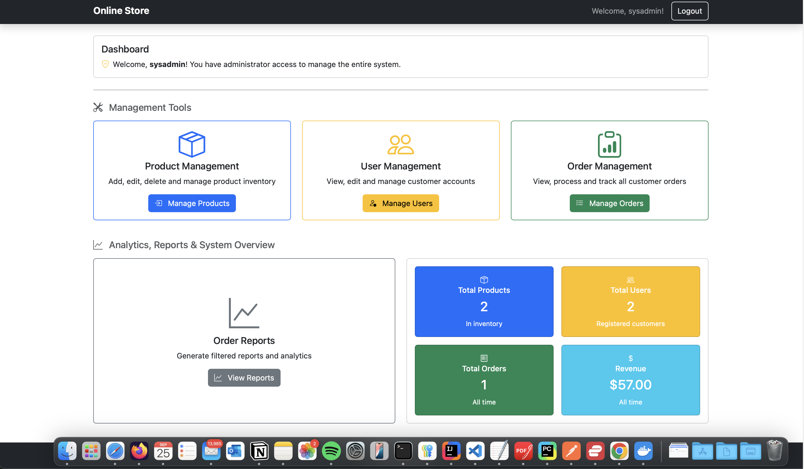
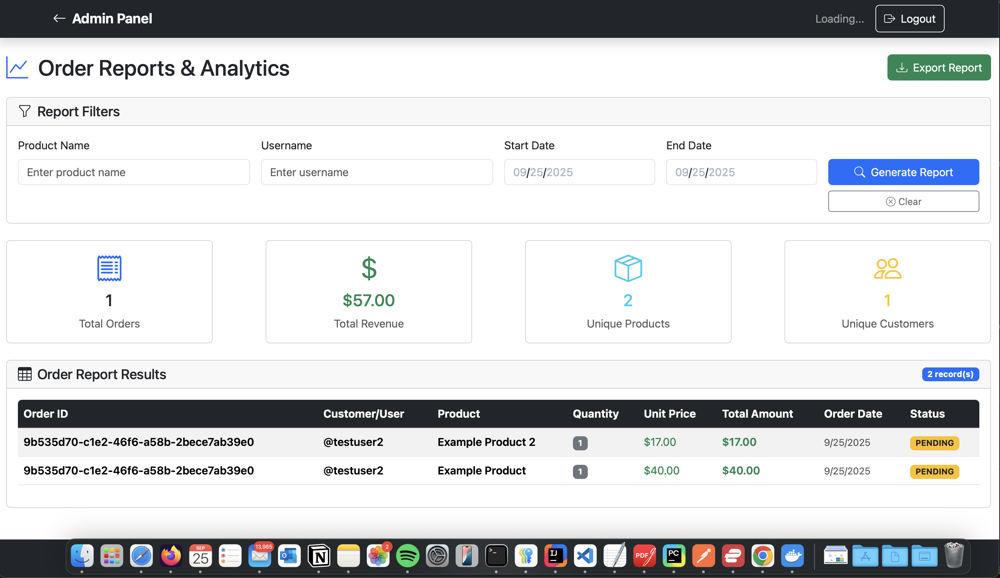
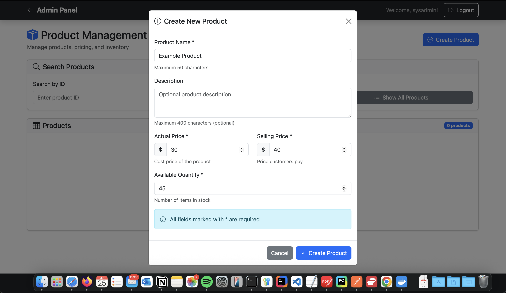
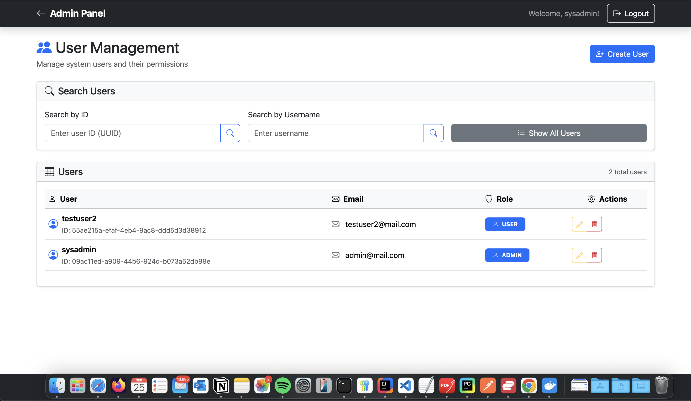
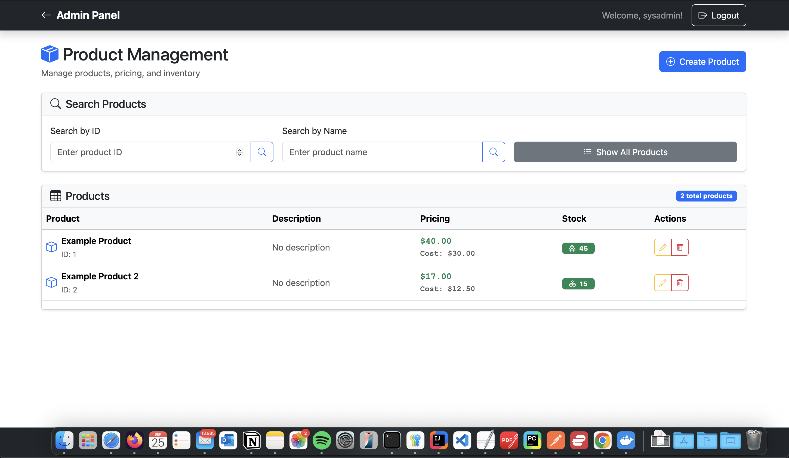
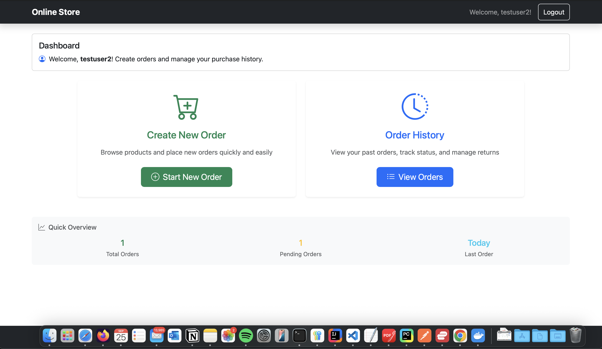
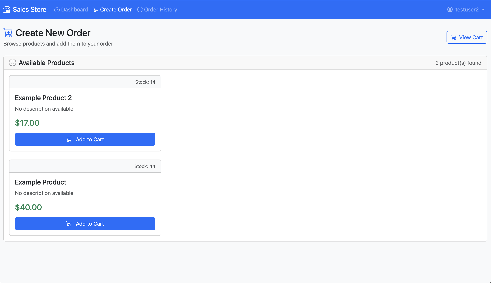
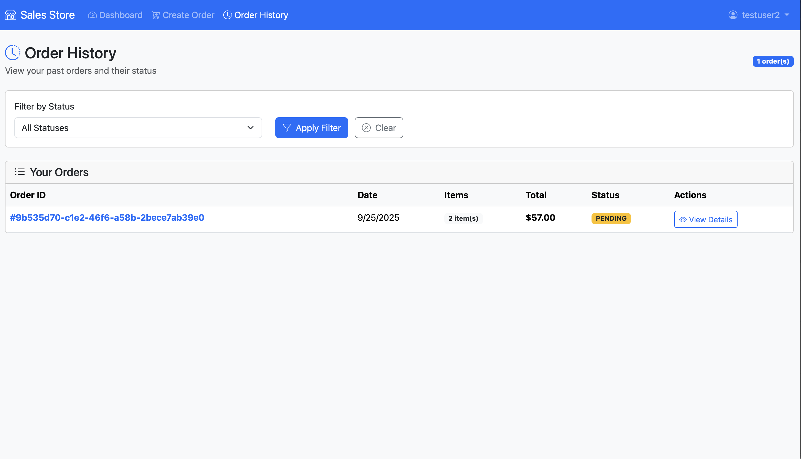

# Sales Store Frontend

## About
**sales-store-frontend** is a user-friendly web application designed to interact with the [sales-store-backend system](https://github.com/TsvetanDyulgerov/sales-store-backend). 
It provides an intuitive interface with dedicated authenticated views for both `admin` and `user` roles, allowing for a seamless and secure experiance.
The frontend works standalone in its own express.js server and communicates with the backend via RESTful API calls.


## Getting Started

The full project is hosted on GitHub: [sales-store-deployment](https://github.com/TsvetanDyulgerov/sales-store-deployment)

1. To use this frontend on its own, clone the repository:
   ```bash
   git clone https://github.com/TsvetanDyulgerov/sales-store-frontend
    ```
   
2. Navigate to the project directory:
    ```bash
     cd sales-store-frontend
   ```
   
3. Configure the environment variables
    - Rename the .env.example file to .env and update the environment variables as needed.


4. Start the application using docker-compose:
    ```bash
    docker-compose up --build
    ```
   

## User Interface Preview















